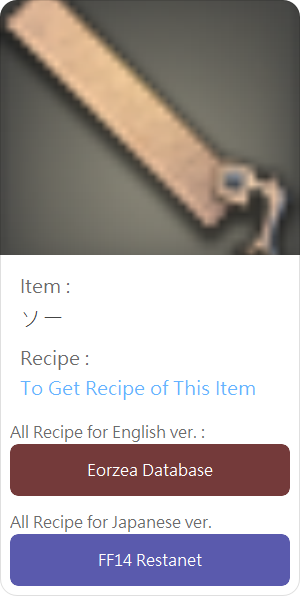
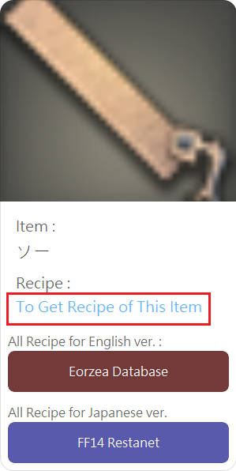
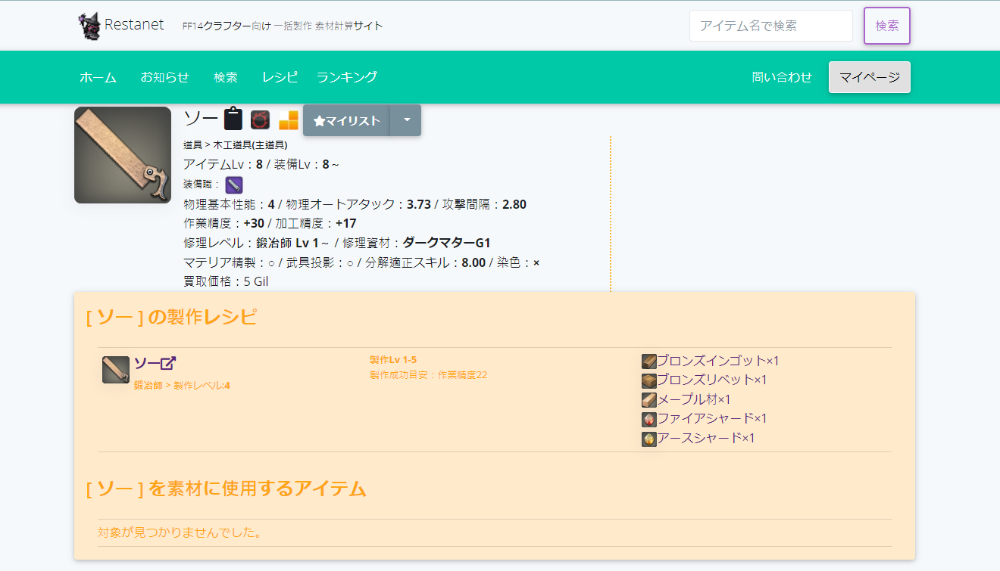
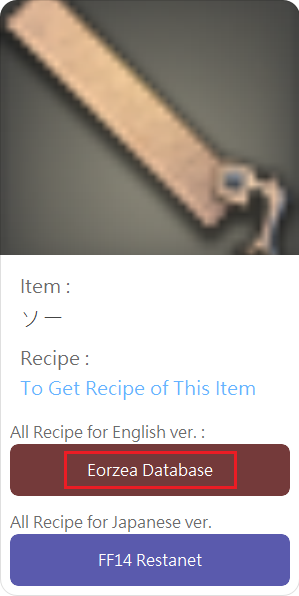
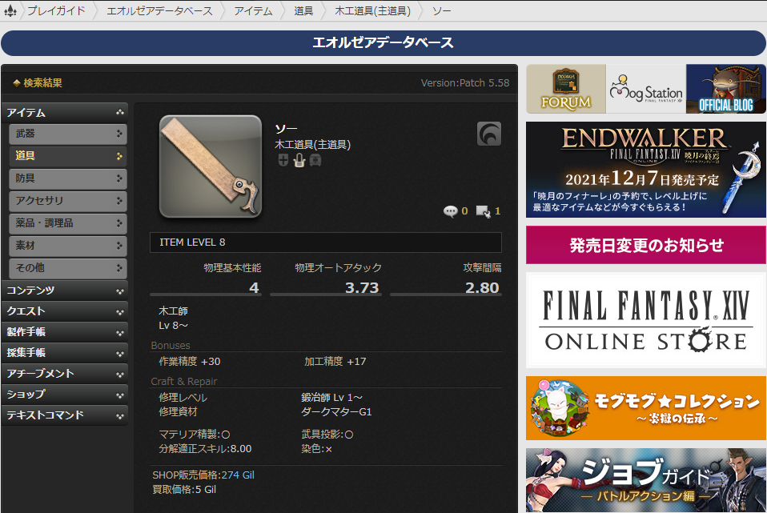
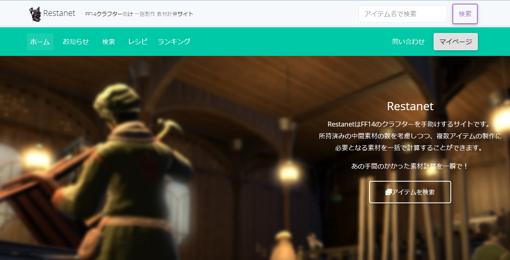

# Introducing:

 Hello,this is Aino,Just a novice developer.

 This Line-bot called "FF14 クラレシ(kurareshi)",help player to search crafting recipe.

 ### This is 1.0 ver. , means will be updata.
 
 Scan this QR code to add the line-bot.
 
 
---

# How to use this Line-bot:
 Fitst, should be type "!" and FF14 "Class Code".
 next, give it a "space".
 at last,type which you want to search.
#### (sorry that this 1.0 ver. , just can search item by Japanese.)

### Example:
    !bsm ソー
      ^    ^
    code  item
    
#### Then you'll get respond form bot like this:

---

click "To get Recipe of This item",will be link to "FF14 Restanet" and show all details of this item.

---

If you want to see all the English "recipe",click here,will be link to "The Lodestone".

---

If you want to see all the Japanese "recipe",click here,will be link to "FF14 Restanet".

### Thanks for everyone.

---

# 自己紹介：
こんにちは、こちらはAinoと申します。
Line-Bot開発初心者なんでが、どうぞよろしくお願い致します。
このボットの名は「FF14 クラレシ」、クラフターのレシピが検索られます。
###  1.0 ver. なので、不完全なところがあって、よければ、いいアイデアを教えていただいてうれしいです。
### アップデート可能です。

こちらのQRコードを読み取って、このラインボット追加されます。

---

#  使用方法：
半角の「!」や「FF14のジョブコード」や半角のスペースを入力して、最後、使用者が検索したいものも入力し。

### 例:
    !bsm ソー
      ^    ^
    code  item
    
#### そして、ボットは使用者検索したのもを返事します:

---

「To get Recipe of This item」を選ぶと、「FF14 Restanet」に移動し、詳細なレシピが確認されます。

---

すべての英語レシピが確認したい方は、こちらのボタン押すと「The Lodestone」に移動します。

---

すべての日本語レシピが確認したい方は、こちらのボタン押すと「FF14 Restanet」に移動します。

### 誠にありがとうございします。

---
### FF14 Crafter job code
    English           Japanese           code
    
    Carpenter         木工師              crp
    Blacksmith        鍛造師              bsm
    Armorer           甲冑師              arm
    Goldsmith         彫金師              gsm
    Leatherworker     革細工師            lwr
    Weaver            裁縫師              wvr
    Alchemist         錬金術師            alc
    Culinarian        調理師              cul
---
(C) SQUARE ENIX CO., LTD. All Rights Reserved.
(C) FF14Restanet - FF14レスタネット All Rights Reserved.
